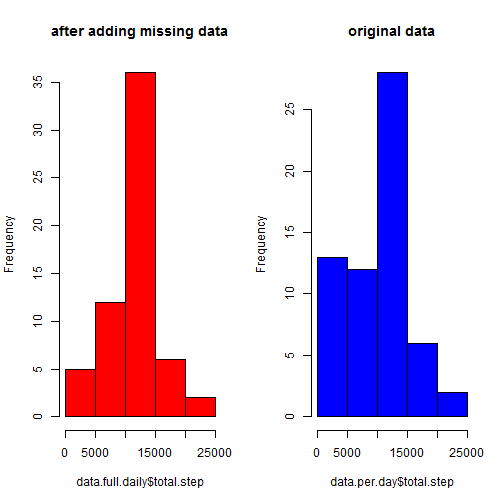

# load and preprocessing the data

#### set my directory, url ect to download the data


```r
dir <- "D:/interest/coursera/Reproducible research/assignment1"
setwd(dir)
file.url <- "https://d396qusza40orc.cloudfront.net/repdata%2Fdata%2Factivity.zip"
```


#### download the data and unzip  
- just ignor the error in the chunk, for some reason url in the code is not compatible to Rmd


```r
download.file(url = file.url, "assignment1.zip")
```

```
## Error: unsupported URL scheme
```

```r
unzip("assignment1.zip")
```


#### read library for later analysis


```r
library(lubridate)
library(plyr)
library(ggplot2)
```


#### pre-process
- read the data
- transform the format
- delete the observation with NA


```r
data <- read.csv("activity.csv")
data$date <- ymd(as.character(data$date))
```


# What is mean total number of steps taken per day?

#### a histogram of the total number of steps taken each day


```r
data.per.day <- ddply(data, .(date), summarise, total.step = sum(steps, na.rm = T), 
    mean.step = mean(steps, na.rm = T), median.step = median(steps, na.rm = T))
hist(data.per.day$total.step)
```

 


#### mean and median total number of steps taken per day


```r
data.per.day[, c(1, 3, 4)]
```

```
##          date mean.step median.step
## 1  2012-10-01       NaN          NA
## 2  2012-10-02    0.4375           0
## 3  2012-10-03   39.4167           0
## 4  2012-10-04   42.0694           0
## 5  2012-10-05   46.1597           0
## 6  2012-10-06   53.5417           0
## 7  2012-10-07   38.2465           0
## 8  2012-10-08       NaN          NA
## 9  2012-10-09   44.4826           0
## 10 2012-10-10   34.3750           0
## 11 2012-10-11   35.7778           0
## 12 2012-10-12   60.3542           0
## 13 2012-10-13   43.1458           0
## 14 2012-10-14   52.4236           0
## 15 2012-10-15   35.2049           0
## 16 2012-10-16   52.3750           0
## 17 2012-10-17   46.7083           0
## 18 2012-10-18   34.9167           0
## 19 2012-10-19   41.0729           0
## 20 2012-10-20   36.0938           0
## 21 2012-10-21   30.6285           0
## 22 2012-10-22   46.7361           0
## 23 2012-10-23   30.9653           0
## 24 2012-10-24   29.0104           0
## 25 2012-10-25    8.6528           0
## 26 2012-10-26   23.5347           0
## 27 2012-10-27   35.1354           0
## 28 2012-10-28   39.7847           0
## 29 2012-10-29   17.4236           0
## 30 2012-10-30   34.0938           0
## 31 2012-10-31   53.5208           0
## 32 2012-11-01       NaN          NA
## 33 2012-11-02   36.8056           0
## 34 2012-11-03   36.7049           0
## 35 2012-11-04       NaN          NA
## 36 2012-11-05   36.2465           0
## 37 2012-11-06   28.9375           0
## 38 2012-11-07   44.7326           0
## 39 2012-11-08   11.1771           0
## 40 2012-11-09       NaN          NA
## 41 2012-11-10       NaN          NA
## 42 2012-11-11   43.7778           0
## 43 2012-11-12   37.3785           0
## 44 2012-11-13   25.4722           0
## 45 2012-11-14       NaN          NA
## 46 2012-11-15    0.1424           0
## 47 2012-11-16   18.8924           0
## 48 2012-11-17   49.7882           0
## 49 2012-11-18   52.4653           0
## 50 2012-11-19   30.6979           0
## 51 2012-11-20   15.5278           0
## 52 2012-11-21   44.3993           0
## 53 2012-11-22   70.9271           0
## 54 2012-11-23   73.5903           0
## 55 2012-11-24   50.2708           0
## 56 2012-11-25   41.0903           0
## 57 2012-11-26   38.7569           0
## 58 2012-11-27   47.3819           0
## 59 2012-11-28   35.3576           0
## 60 2012-11-29   24.4688           0
## 61 2012-11-30       NaN          NA
```


# What is the average daily activity pattern?

####  time series plot on daily activity


```r
data.interval <- ddply(data, .(interval), summarise, mean.step = mean(steps, 
    na.rm = T))
with(data.interval, plot(interval, mean.step, type = "l"))
```

 


#### report the interval contain maxium number


```r
data.interval[which.max(data.interval$mean.step), ]
```

```
##     interval mean.step
## 104      835     206.2
```


# Imputing missing values

#### report the total number of missing values


```r
data.full <- read.csv("activity.csv")
number <- table(is.na(data.full$steps))["TRUE"]
print(as.numeric(number))
```

```
## [1] 2304
```


#### fill the data by daily mean of interval
#### create a new dataset with missing data fill in


```r
na.idx <- which(is.na(data.full$steps))
data.full$date <- ymd(data.full$date)
data.full[na.idx, ]$steps <- data.interval[match(data.full[na.idx, ]$interval, 
    data.interval$interval), "mean.step"]
```


#### compute daily steps


```r
data.full.daily <- ddply(data.full, .(date), summarise, mean.step = mean(steps), 
    median.step = median(steps))
print(data.full.daily)
```

```
##          date mean.step median.step
## 1  2012-10-01   37.3826       34.11
## 2  2012-10-02    0.4375        0.00
## 3  2012-10-03   39.4167        0.00
## 4  2012-10-04   42.0694        0.00
## 5  2012-10-05   46.1597        0.00
## 6  2012-10-06   53.5417        0.00
## 7  2012-10-07   38.2465        0.00
## 8  2012-10-08   37.3826       34.11
## 9  2012-10-09   44.4826        0.00
## 10 2012-10-10   34.3750        0.00
## 11 2012-10-11   35.7778        0.00
## 12 2012-10-12   60.3542        0.00
## 13 2012-10-13   43.1458        0.00
## 14 2012-10-14   52.4236        0.00
## 15 2012-10-15   35.2049        0.00
## 16 2012-10-16   52.3750        0.00
## 17 2012-10-17   46.7083        0.00
## 18 2012-10-18   34.9167        0.00
## 19 2012-10-19   41.0729        0.00
## 20 2012-10-20   36.0938        0.00
## 21 2012-10-21   30.6285        0.00
## 22 2012-10-22   46.7361        0.00
## 23 2012-10-23   30.9653        0.00
## 24 2012-10-24   29.0104        0.00
## 25 2012-10-25    8.6528        0.00
## 26 2012-10-26   23.5347        0.00
## 27 2012-10-27   35.1354        0.00
## 28 2012-10-28   39.7847        0.00
## 29 2012-10-29   17.4236        0.00
## 30 2012-10-30   34.0938        0.00
## 31 2012-10-31   53.5208        0.00
## 32 2012-11-01   37.3826       34.11
## 33 2012-11-02   36.8056        0.00
## 34 2012-11-03   36.7049        0.00
## 35 2012-11-04   37.3826       34.11
## 36 2012-11-05   36.2465        0.00
## 37 2012-11-06   28.9375        0.00
## 38 2012-11-07   44.7326        0.00
## 39 2012-11-08   11.1771        0.00
## 40 2012-11-09   37.3826       34.11
## 41 2012-11-10   37.3826       34.11
## 42 2012-11-11   43.7778        0.00
## 43 2012-11-12   37.3785        0.00
## 44 2012-11-13   25.4722        0.00
## 45 2012-11-14   37.3826       34.11
## 46 2012-11-15    0.1424        0.00
## 47 2012-11-16   18.8924        0.00
## 48 2012-11-17   49.7882        0.00
## 49 2012-11-18   52.4653        0.00
## 50 2012-11-19   30.6979        0.00
## 51 2012-11-20   15.5278        0.00
## 52 2012-11-21   44.3993        0.00
## 53 2012-11-22   70.9271        0.00
## 54 2012-11-23   73.5903        0.00
## 55 2012-11-24   50.2708        0.00
## 56 2012-11-25   41.0903        0.00
## 57 2012-11-26   38.7569        0.00
## 58 2012-11-27   47.3819        0.00
## 59 2012-11-28   35.3576        0.00
## 60 2012-11-29   24.4688        0.00
## 61 2012-11-30   37.3826       34.11
```


#### make a histograme and compare to previous one
- based on this filling in, it seems that the full data "connect" the broken line
- there is no big differece between the original and full data


```r
par(mfrow = c(2, 1))
with(data.per.day, plot(date, mean.step, type = "l", col = "red"))
with(data.full.daily, plot(date, mean.step, type = "l", col = "blue"))
```

 


# Are there differences in activity patterns between weekdays and weekends?

#### check the differnce between weekdays and weekends


```r
data$weekday <- weekdays(data$date)
data <- data[complete.cases(data), ]
data$weekday.category <- NA
data$weekday.category <- ifelse(data$weekday %in% list("Sunday", "Saturday"), 
    "weekend", "weekday")
data.weekday <- ddply(data, .(weekday.category, interval), summarise, mean.step = mean(steps))
```


#### make as plot for comparison


```r
ggplot(data.weekday, aes(interval, mean.step, color = weekday.category)) + geom_line() + 
    facet_grid(weekday.category ~ .)
```

 


